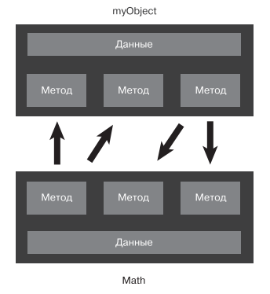
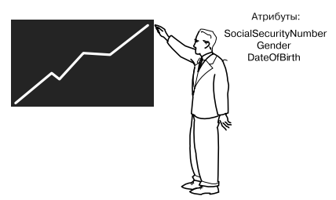
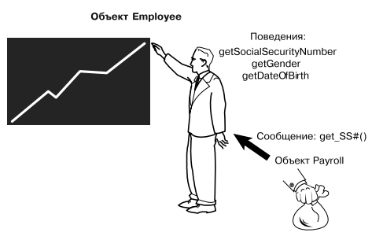

# OOP

The Object-Oriented Thought Proccess Matt Weisfeld (summary)

---

## Фундаментальные концепции

Исторически сложилось так, что объектно-ориентированные языки определяются
следующими концепциями: инкапсуляцией, наследованием и полиморфизмом (+композиция).

---

## Взаимодействие между объектами



Для взаимодействия объектов между собой им необходимо лишь знать с помощью
каких методов они могут обратиться к другому объекту. Реализация этого метода в нутри
другого объекта не важна.

---

## Объект

Объекты — это строительные блоки объектно-ориентированных программ. Та или
иная программа, которая задействует объектно-ориентированную технологию, по
сути является набором объектов.

### Данные

Данные, содержащиеся в объекте, представляют его состояние. В терминологии
объектно-ориентированного программирования эти данные называются атрибутами.

Пример объекта Employee



Реализация на typescript

```ts
/** Класс "Работник" */
class Employee {
    /** Номер социального страхования */
    socialSecurityNumber: number;

    /** Пол */
    gender: string;

    /** Датат рождения */
    dateOfBirth: Date;
}
```

### Поведения объектов

Поведение объекта представляет то, что он может сделать.
В процедурных языках поведение определяется процедурами,
функциями и подпрограммами.
В терминологии объектно-ориентированного программирования
поведения объектов содержатся в методах, а вызов
метода осуществляется путем отправки ему сообщения.

#### Геттеры и Сеттеры (Get / Set)

Концепция геттеров и сеттеров поддерживает концепцию скрытия данных.
Поскольку другие объекты не должны напрямую манипулировать данными,
содержащимися в одном из объектов, геттеры и сеттеры обеспечивают
управляемый доступ к данным объекта. Геттеры и сеттеры иногда
называют методами доступа и методами-модификаторами соответственно.

все, что пользователям потребуется
знать для эффективного применения методов:

- имя метода;
- параметры, передаваемые методу;
- возвращаемый тип метода.



```ts
/** Класс "Работник" */
class Employee {
    /** Номер социального страхования */
    socialSecurityNumber: number;

    /** Пол */
    gender: string;

    /** Дата рождения */
    dateOfBirth: Date;

    /** Get - Номер социального страхования */
    getSSN(): number {
        return this.socialSecurityNumber;
    }

    /** Get - Пол */
    getGender(): string {
        return this.gender;
    }

    /** Get - Дата рождения */
    getDateOfBirth(): Date {
        return this.dateOfBirth;
    }

    /** Set - Номер социального страхования */
    setSSN(SSN: number): void {
        this.socialSecurityNumber = SSN;
    }

    /** Set - Пол */
    setGender(gender: string): void {
        this.gender = gender;
    }

    /** Set - Дата рождения */
    setDateOfBirth(dateOfBirth: Date): void {
        this.dateOfBirth = dateOfBirth;
    }
}
```

---

## Класс

Если говорить просто, то класс — это «чертеж» объекта.
При создании экземпляра объекта вы станете использовать класс как основу для того,
как этот объект будет создаваться.

---

### Создание объектов

```ts
const john = new Employee();
```

---

## Инкапсуляция и скрытие данных

Одно из основных преимуществ использования объектов заключается в том, что
объекту не нужно показывать все свои атрибуты и поведения. При хорошем объектно-
ориентированном проектировании (по крайней мере, при таком, которое повсемест-
но считается хорошим) объект должен показывать только интерфейсы, необходимые
другим объектам для взаимодействия с ним. Детали, не относящиеся к использова-
нию объекта, должны быть скрыты от всех других объектов.
Инкапсуляция определяется тем, что объекты содержат как атрибуты, так и по-
ведения. Скрытие данных является основной частью инкапсуляции.

```ts
/** Класс "Работник" */
class Employee {
    /** Номер социального страхования */
    private socialSecurityNumber: number;

    /** Пол */
    private gender: string;

    /** Дата рождения */
    private dateOfBirth: Date;

    /** Get - Номер социального страхования */
    public getSSN(): number {
        return this.socialSecurityNumber;
    };

    /** Get - Пол */
    public getGender(): string {
        return this.gender;
    };

    /** Get - Дата рождения */
    public getDateOfBirth(): Date {
        return this.dateOfBirth;
    };

    /** Set - Номер социального страхования */
    public setSSN(SSN: number): void {
        this.socialSecurityNumber = SSN;
    };

    /** Set - Пол */
    public setGender(gender: string): void {
        this.gender = gender;
    };

    /** Set - Дата рождения */
    public setDateOfBirth(dateOfBirth: Date): void {
        this.dateOfBirth = dateOfBirth;
    };
}
```

---

## Наследование

Одной из наиболее сильных сторон объектно-ориентированного программирова-
ния, пожалуй, является повторное использование кода. При структурном проек-
тировании повторное использование кода допускается в известной мере: вы може-
те написать процедуру, а затем применять ее столько раз, сколько пожелаете.
Однако объектно-ориентированное проектирование делает важный шаг вперед,
позволяя вам определять отношения между классами, которые не только облегча-
ют повторное использование кода, но и способствуют созданию лучшей общей
конструкции путем упорядочения и учета общности разнообразных классов.
Основное средство обеспечения такой функциональности — наследование.
Наследование позволяет классу наследовать атрибуты и методы другого класса.
Это дает возможность создавать абсолютно новые классы путем абстрагирования
общих атрибутов и поведений.
Одна из основных задач проектирования при объектно-ориентированном про-
граммировании заключается в выделении общности разнообразных классов.

```ts
import Employee from "./employee";

export default class Programmer extends Employee {
    /** Уровень */
    private grade: number;

    /** Get - Уровень */
    getGrade(): number {
        return this.grade;
    }

    /** Set - Уровень */
    setGrade(grade: number): void {
        this.grade = grade;
    }
}
```

```ts
import Employee from "./employee";

export default class Solidier extends Employee {
    /** Звание */
    private rank: string;

    /** Get - Звание */
    getRank(): string {
        return this.rank;
    }

    /** Set - Звание */
    setRank(rank: string): void {
        this.rank = rank;
    }
}
```

---

### Суперклассы и подклассы

Суперкласс, или родительский класс (иногда называемый базовым), содержит все
атрибуты и поведения, общие для классов, которые наследуют от него. Например,
в случае с классом Employee все классы работников содержат аналогичные атрибуты,
такие как socialSecurityNumber, gender, dateOfBirth а также поведения вроде getSSN,
и getGender и. т. д.

Подкласс, или дочерний класс (иногда называемый производным), представляет
собой расширение суперкласса. Таким образом, классы Programmer и Soldier
наследуют все общие атрибуты и поведения от класса Employee.
Класс Employee считается суперклассом подклассов,
или дочерних классов, Programmer и Soldier.

---

### Абстрагирование

Дерево наследования может разрастись довольно сильно. Когда классы Employee и Programmer
будут готовы, добавить другие классы, например солдат (или frontend,
backend), не составит особого труда. Класс Programmer также может выступать
в роли суперкласса. Например, может потребоваться дополнительно абстрагировать
Programmer, чтобы обеспечить классы для frontend,
backend и т. д. Точно так же, как и Programmer, класс Soldier может выступать
в роли родительского класса для других классов, например
Pilot и Marine. Мощь наследования заключается
в его методиках абстрагирования и организации.

---

### Полиморфизм

Полиморфизм — это греческое слово, буквально означающее множественность
форм. Несмотря на то что полиморфизм тесно связан с наследованием, он часто
упоминается отдельно от него как одно из наиболее весомых преимуществ
объектно-ориентированных технологий. Если потребуется отправить сообщение
объекту, он должен располагать методом, определенным для ответа на это со-
общение. В иерархии наследования все подклассы наследуют от своих супер-
классов. Однако, поскольку каждый подкласс представляет собой отдельную
сущность, каждому из них может потребоваться дать отдельный ответ на одно
и то же сообщение.

---

### Композиция

Означает, что объект формируется из других объектов.

---

```ts
export default abstract class Employee {
    abstract work(): void;
}
```

```ts
export default class Programmer {
    work(): void {
        console.log("'I'm coding!");
    };
}
```

```ts
export default class Soldier {
    work(): void {
        console.log("'I'm saving!");
    };
}
```

*Примечание:*

Для использования полиморфизма необходимо создавть абстрактный класс, с ключевым словом abstract,
затем в каждом подклассе этот метод необходимо реализовать, по примеру выше.

---

### Конструкторы

```ts
export default abstract class Employee {
    constructor(SSN: number, gender: string, dateOfBirth: Date) {
        this.socialSecurityNumber = SSN;
        this.gender = gender;
        this.dateOfBirth = dateOfBirth;
    }
}
```

```ts
export default class Programmer extends Employee {
    constructor(SSN: number, gender: string, dateOfBirth: Date, grade: number) {
        super(SSN, gender, dateOfBirth);
        this._grade = grade;
    }
}
```

Для использования конструкторов в подклассах, необходимо указывать ключевое слово super(), если конструктор не определён в начальном классе,
необходимо все равно указать это слово, затем распеределить данные по атрибутам класса.
